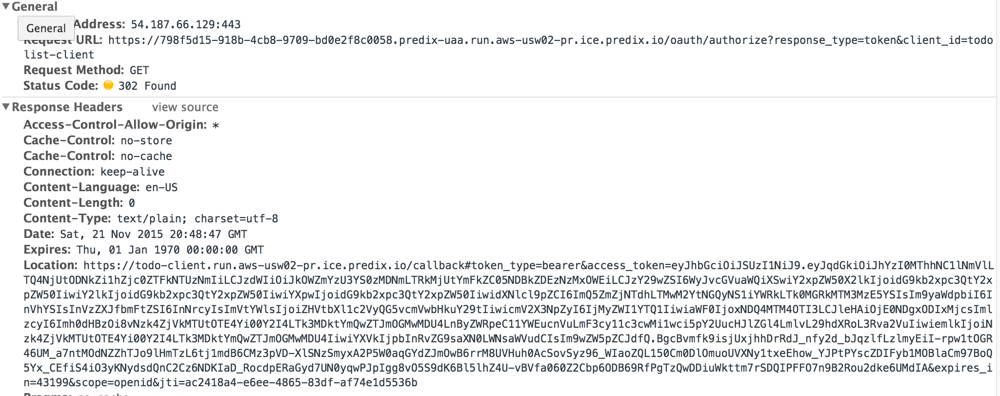

## Getting Token from UAA

Now that we have created a Client as well as user. Its time for the client to get the token for a logged in user.

Remember we are still using [implicit Grant flow](https://github.com/cloudfoundry/uaa/blob/master/docs/UAA-APIs.rst#implicit-grant-for-browsers-get-oauthauthorize).

## Steps
#### Testing The flow

1. Go to ` https://<UAA_INSTANCE_ID>.predix-uaa.run.aws-usw02-pr.ice.predix.io/oauth/authorize?response_type=token&client_id=<CLIENT_ID> ` and give the test user credentials that were created [before](./create_dummy_users_in_uaa.md).

For example: Check the screenshot.

Any request to UAA Server ` /oauth/authorize ` endpoint resulted in a [302 Status Code](https://en.wikipedia.org/wiki/HTTP_302) with the location Header set to ` https://todo-client.run.aws-usw02-pr.ice.predix.io ` with the parameters `access_token ` , `token_type` , `expires_in`,`scope` & `jti`

PS : I already had a session with UAA. Hence got redirect in singleshot

##### Explanation
* We Just asked UAA instance to give us a token (check the request paramter ` response_type `)
* We Provided the ` client_id ` as well
* Since we had given the callback URL [before](./registering_client_in_uaa.md) while creating the client, The browser gets a redirect to the callback URL with a token

##### Additional Configuration done on the client side.
1. Enabled [HTML5 Mode](https://docs.angularjs.org/guide/$location) in nginx. [Click here for Code Change](https://github.com/sks/predix-sample/pull/11/files#diff-482fe9fd97c71894541b48caf46732ddR41).
    1. This way when the UAA redirects to ` /callback `, ` index.html ` page is returned and the we don't get a ` 404 ` Error page

##References

* [Cloufoundry Implicity Grant Flow For Browsers](https://github.com/cloudfoundry/uaa/blob/master/docs/UAA-APIs.rst#implicit-grant-for-browsers-get-oauthauthorize)
* [Implicit-Grant-Flow: clever.com](https://dev.clever.com/instant-login/implicit-grant-flow)
* [JWT Bearer](https://bshaffer.github.io/oauth2-server-php-docs/grant-types/jwt-bearer/)
